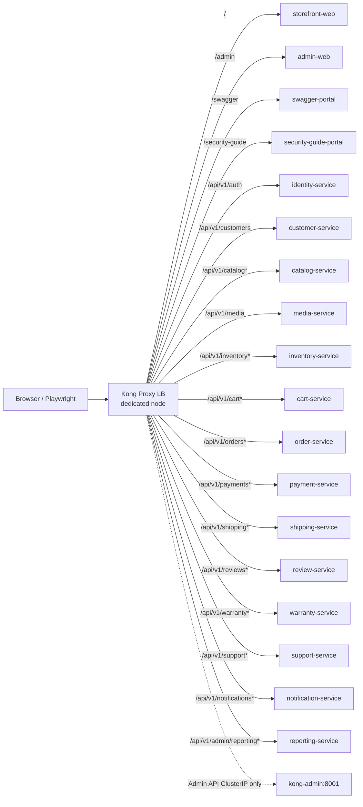

# Kong routing architecture (LAN/IP first)

Notes:

- Strip-path only for portal UI prefixes (`/admin`, `/swagger`, `/security-guide`).
- API paths preserve `/api/v1/...` for Nest global prefixes (no duplicated `/shipping/shipping`).
- Lab routes IP-restricted.
- PUBLIC\_\*\_URL config values — no hard-coded deployment IPs in app source.
