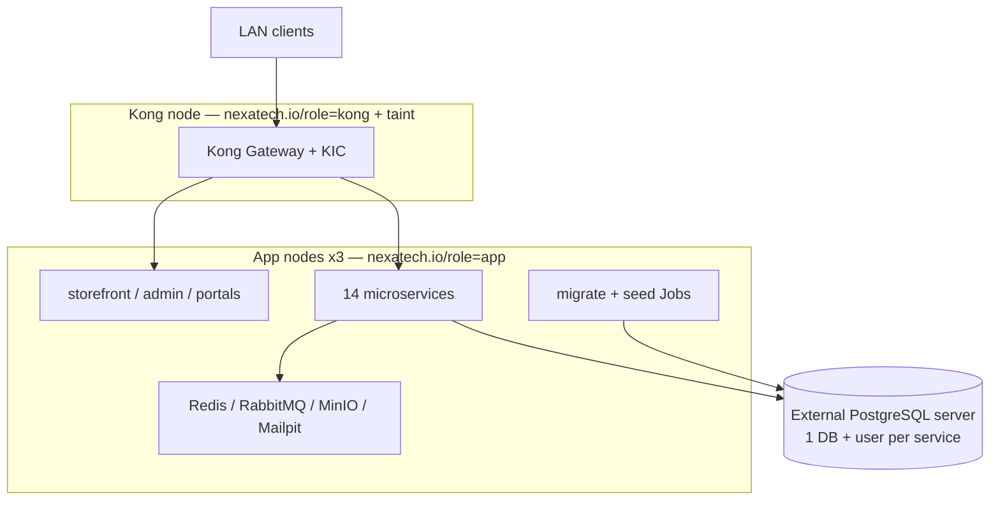

# Kubernetes deployment topology

Scheduling:

- Application workloads: `nodeSelector: nexatech.io/role=app` + topology spread
- Kong: `nodeSelector: nexatech.io/role=kong` + toleration `dedicated=kong:NoSchedule`
- Migrations: dedicated Jobs before rollout — never in app replicas
