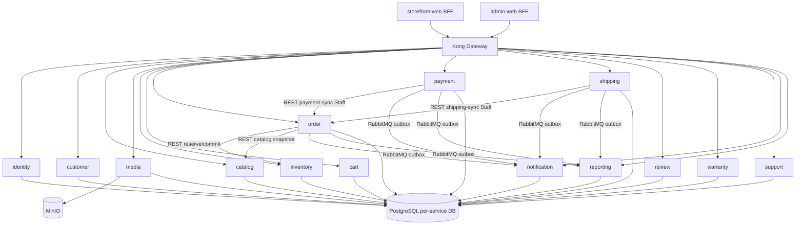

# Microservice architecture

```mermaid
flowchart TB
  SF[storefront-web BFF] --> Kong
  AD[admin-web BFF] --> Kong
  Kong[Kong Gateway]
  Kong --> ID[identity]
  Kong --> CU[customer]
  Kong --> CA[catalog]
  Kong --> ME[media]
  Kong --> INV[inventory]
  Kong --> CART[cart]
  Kong --> ORD[order]
  Kong --> PAY[payment]
  Kong --> SHIP[shipping]
  Kong --> REV[review]
  Kong --> WAR[warranty]
  Kong --> SUP[support]
  Kong --> NOT[notification]
  Kong --> RPT[reporting]
  ORD -->|REST reserve/commit| INV
  ORD -->|REST catalog snapshot| CA
  PAY -->|REST payment-sync Staff| ORD
  SHIP -->|REST shipping-sync Staff| ORD
  ORD & PAY & SHIP -->|RabbitMQ outbox| NOT
  ORD & PAY & SHIP -->|RabbitMQ outbox| RPT
  ME --> MinIO[(MinIO)]
  ID & CU & CA & ME & INV & CART & ORD & PAY & SHIP & REV & WAR & SUP & NOT & RPT --> PG[(PostgreSQL per-service DB)]
```
