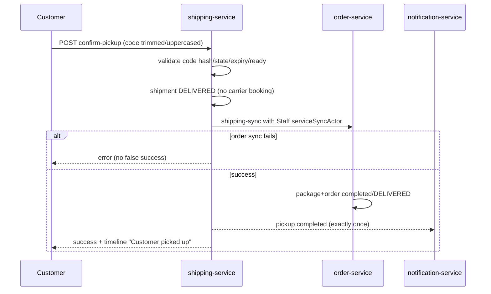

# Store Pickup completion sync (P0)

```mermaid
sequenceDiagram
  participant Cust as Customer
  participant Ship as shipping-service
  participant Order as order-service
  participant Notif as notification-service
  Cust->>Ship: POST confirm-pickup (code trimmed/uppercased)
  Ship->>Ship: validate code hash/state/expiry/ready
  Ship->>Ship: shipment DELIVERED (no carrier booking)
  Ship->>Order: shipping-sync with Staff serviceSyncActor
  alt order sync fails
    Ship-->>Cust: error (no false success)
  else success
    Order->>Order: package+order completed/DELIVERED
    Ship-->>Notif: pickup completed (exactly once)
    Ship-->>Cust: success + timeline "Customer picked up"
  end
```
