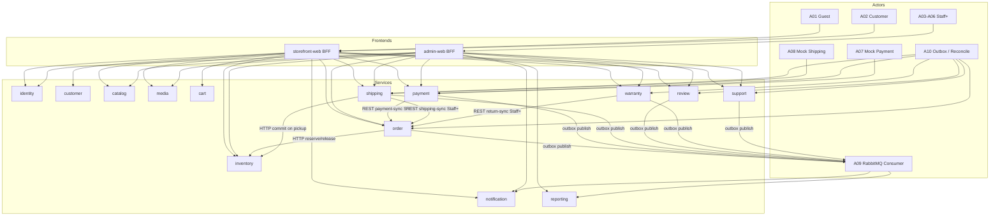
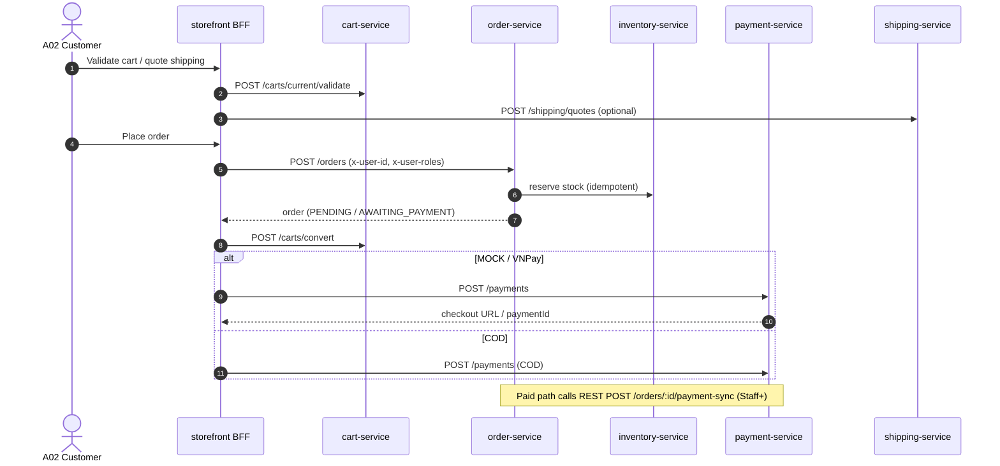
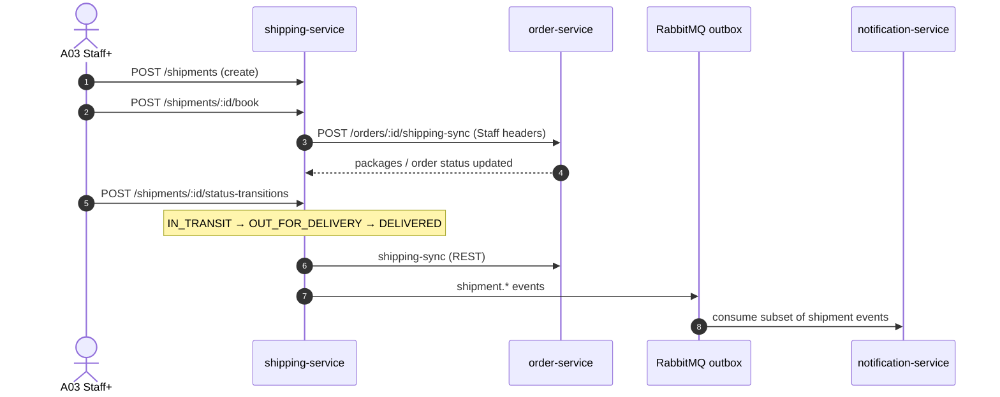
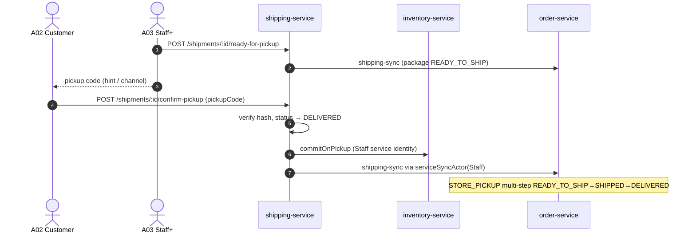
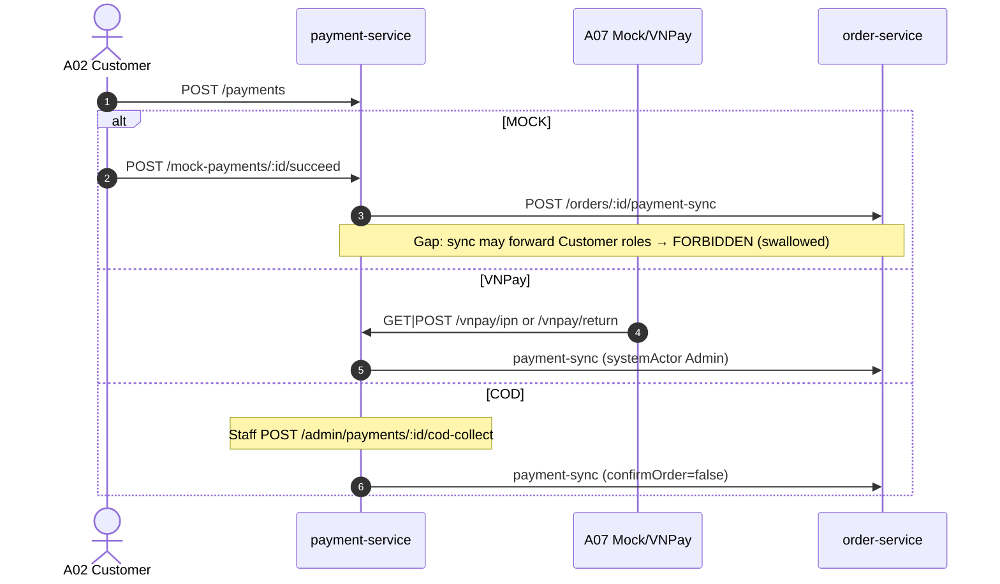
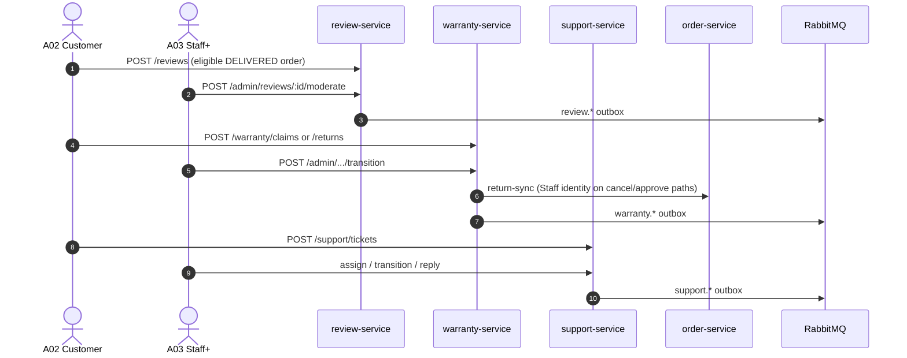
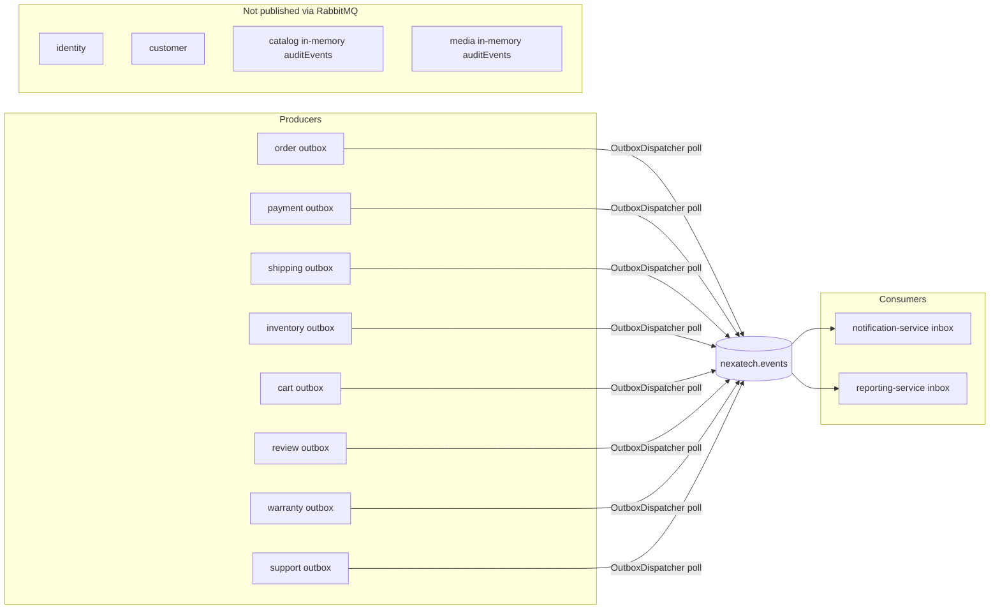

# 00 — System Use-Case Overview

> Source of truth: audited Nest controllers, BFF proxies, Prisma enums, outbox publishers, and RabbitMQ consumers as of Local RC (2026-08-04).
> Do **not** treat docs/EVENTS.md as runtime truth where it conflicts with code.

## Actors

| ID  | Actor                          | Description                                                             |
| --- | ------------------------------ | ----------------------------------------------------------------------- |
| A01 | Guest                          | Unauthenticated storefront visitor; may use cart token / guest tracking |
| A02 | Customer                       | Authenticated end-user (`Customer` role)                                |
| A03 | Staff                          | Internal operator (`Staff`)                                             |
| A04 | Manager                        | Internal manager (`Manager`)                                            |
| A05 | Admin                          | Platform admin (`Admin`)                                                |
| A06 | Super Admin                    | Highest RBAC (`SuperAdmin`)                                             |
| A07 | Mock Payment Provider          | Mock / VNPay sandbox callbacks                                          |
| A08 | Mock Shipping Provider         | Mock carrier webhook / booking adapter                                  |
| A09 | RabbitMQ Consumer              | notification-service / reporting-service inbox consumers                |
| A10 | Scheduled / Reconciliation Job | Outbox pollers; admin `reconcile-fulfillment`; CLI scripts              |

## Auth model (critical)

- Services trust inbound headers: `x-user-id`, `x-user-roles` (comma-separated), optional `Authorization: Bearer`.
- Storefront/admin BFF injects headers from cookie session — **no Nest `JwtAuthGuard`** on microservices.
- Role checks are service-local (`requireStaff` / `hasMinimumRole(..., Roles.Staff)`).

## Status enums (code)

**Order:** `PENDING`, `AWAITING_PAYMENT`, `CONFIRMED`, `PROCESSING`, `READY_TO_SHIP`, `SHIPPED`, `DELIVERED`, `CANCELLED`, `RETURN_REQUESTED`, `RETURNED`, `FAILED`

**Package:** `PENDING`, `ALLOCATED`, `READY_TO_SHIP`, `SHIPPED`, `DELIVERED`, `CANCELLED`

**Shipment:** `CREATED`, `QUOTED`, `BOOKED`, `READY_FOR_PICKUP`, `PICKED_UP`, `IN_TRANSIT`, `OUT_FOR_DELIVERY`, `DELIVERED`, `DELIVERY_FAILED`, `CANCELLED`, `RETURN_TO_SENDER`, `RETURNED`

## Critical architecture facts

1. **Order ↔ shipping sync is REST**, not a RabbitMQ consumer on order-service:
   `POST /api/v1/orders/:orderId/shipping-sync` (Staff+). Shipping-service calls this via `HttpOrderClient`.
2. **Shipping outbox** publishes `shipping.shipment.*` for notification/reporting consumers.
3. **STORE_PICKUP confirm-pickup:** customer verifies pickup code → shipment `DELIVERED` → `syncOrder` **must** use Staff service identity (`serviceSyncActor`).
4. **Available stock** = `onHand - reserved`.
5. **Integration DB guard:** suites require `*_TEST_DATABASE_URL` pointing at `nexatech_<service>_test` only — never runtime `*_DATABASE_URL`.

## Service route prefixes (global `/api/v1` and `/api/v2`)

| Service      | Prefixes                                                       |
| ------------ | -------------------------------------------------------------- |
| identity     | `auth/*`, `admin/users/*`                                      |
| customer     | `customers/me`, `customers/me/addresses`                       |
| catalog      | `categories`, `brands`, `products`, `skus`, `admin/catalog/*`  |
| media        | `media/*`                                                      |
| inventory    | `warehouses`, `stores`, `stock`, `admin/inventory/*`           |
| cart         | `carts`, `wishlist`, `comparison`, `recently-viewed`           |
| order        | `orders/*`, `admin/orders/*`                                   |
| payment      | `payments/*`, `mock-payments/*`, `vnpay/*`, `admin/payments/*` |
| shipping     | `shipping/*`, `shipments/*`, `admin/shipments/*`               |
| review       | `reviews/*`, `products/:id/reviews`, `admin/*`                 |
| warranty     | `warranty/claims`, `returns`, `admin/*`                        |
| support      | `support/tickets`, `admin/support/*`                           |
| notification | `notifications/*`, `admin/notifications/*`                     |
| reporting    | `admin/reporting/*`                                            |

## Document index

| File                                                 | Domain                                   | UC ID prefix           |
| ---------------------------------------------------- | ---------------------------------------- | ---------------------- |
| [01-identity.md](./01-identity.md)                   | Identity & auth                          | `UC-ID-*`              |
| [02-customer.md](./02-customer.md)                   | Customer profile & addresses             | `UC-CUS-*`             |
| [03-catalog-media.md](./03-catalog-media.md)         | Catalog & media                          | `UC-CAT-*`, `UC-MED-*` |
| [04-inventory.md](./04-inventory.md)                 | Warehouses, stores, stock                | `UC-INV-*`             |
| [05-cart-commerce.md](./05-cart-commerce.md)         | Cart, wishlist, compare, recently viewed | `UC-CART-*`            |
| [06-checkout-order.md](./06-checkout-order.md)       | Checkout & order lifecycle               | `UC-ORD-*`             |
| [07-payment.md](./07-payment.md)                     | COD / Mock / VNPay                       | `UC-PAY-*`             |
| [08-shipping-standard.md](./08-shipping-standard.md) | Standard delivery                        | `UC-SHIP-*`            |
| [09-store-pickup.md](./09-store-pickup.md)           | Store pickup                             | `UC-PICK-*`            |
| [10-review.md](./10-review.md)                       | Product reviews                          | `UC-REV-*`             |
| [11-warranty-return.md](./11-warranty-return.md)     | Warranty & returns                       | `UC-WAR-*`, `UC-RET-*` |
| [12-support.md](./12-support.md)                     | Support tickets                          | `UC-SUP-*`             |
| [13-notification.md](./13-notification.md)           | In-app + email notifications             | `UC-NOT-*`             |
| [14-reporting.md](./14-reporting.md)                 | Dashboard & reports                      | `UC-RPT-*`             |
| [15-admin-rbac.md](./15-admin-rbac.md)               | Admin RBAC matrix                        | `UC-ADM-*`             |
| [16-api-gateway-bff.md](./16-api-gateway-bff.md)     | BFF / session gateway                    | `UC-BFF-*`             |

## System use-case diagram



## Checkout sequence



## Standard shipping sequence



## Store pickup sequence



## Payment sequence



## Review / warranty / support sequence



## Event / outbox flow



## Cross-cutting response contract

All Nest services use `useNexaTechExceptionFilter` → error envelope:

```json
{
  "errorCode": "string",
  "message": "string",
  "details": {},
  "traceId": "string",
  "timestamp": "ISO-8601"
}
```

Success bodies follow Zod DTOs in `@nexatech/shared-contracts`.

## Platform Known gaps / Current implementation status

| Area                                             | Status          | Notes                                                                                           |
| ------------------------------------------------ | --------------- | ----------------------------------------------------------------------------------------------- |
| identity / customer / catalog RabbitMQ publish   | **Gap**         | Contract keys exist; identity/customer emit nothing; catalog/media only in-memory `auditEvents` |
| InMemory HTTP clients when `SERVICE_URL` missing | **Partial**     | Historically activated; being fail-fasted via compose env wiring                                |
| STORE_PICKUP Staff header on shipping-sync       | **Implemented** | `serviceSyncActor` + unit tests                                                                 |
| Payment-sync Staff identity on mock succeed      | **Gap**         | Forwards caller roles; Customer → FORBIDDEN swallowed                                           |
| Google OAuth production                          | **Gap**         | Schema + disabled UI; no prod authorize/callback                                                |
| Invoice PDF                                      | **Gap**         | No order-service PDF implementation found                                                       |
| Runtime Orders table empty                       | **Operational** | RC may have 0 rows in `nexatech_order."Order"`                                                  |
| Integration tests                                | **Implemented** | `*_TEST_DATABASE_URL` → `nexatech_<service>_test` only                                          |

## Use case field template

Every UC entry in subsequent files includes:

Use case ID · Name · Actor · Supporting actors/services · Preconditions · Trigger · Input · Main flow · Alternate flows · Error flows · Authorization · Database changes · Events produced · Events consumed · API endpoints · Response contract · Idempotency rule · Postconditions · Automated test mapping · Current implementation status · Known gaps
